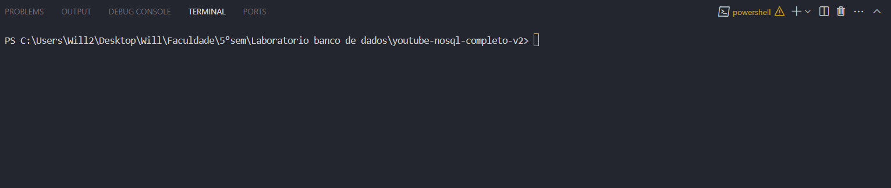

# 📊 Projeto Prático – Coleta de Dados com YouTube API + MongoDB

Este projeto tem como objetivo demonstrar a integração entre **fontes de dados externas** (YouTube) e **bancos de dados NoSQL**, usando Python, a biblioteca `youtool` e o banco MongoDB.

A proposta é extrair informações do canal **Manual do Mundo** como:
- Comentários dos vídeos
- Transcrições automáticas

Esses dados são armazenados em um banco de dados **MongoDB local** e podem ser consultados para análise posterior.

---

## 🛠️ Tecnologias Utilizadas

| Ferramenta       | Finalidade                            |
|------------------|----------------------------------------|
| Python           | Lógica de programação e scripts        |
| MongoDB          | Banco de dados NoSQL local             |
| youtool          | Biblioteca para acessar a API do YouTube |
| dotenv           | Leitura de variáveis do arquivo `.env` |

---

## 🧱 Estrutura do Projeto


---

## ▶️ Como Executar

### 1. Configure sua API KEY do YouTube
- Crie uma chave em: https://console.cloud.google.com/
- Ative a API **YouTube Data API v3**
- No arquivo `.env`, insira sua chave:


### 2. Instale as dependências
```bash
pip install pymongo python-dotenv
# Coleta os dados do canal Manual do Mundo
python src/fetch_data.py

# Insere os dados no MongoDB local
python src/insert_to_mongo.py

# Consulta os dados (títulos, comentários, palavras-chave)
python src/query_data.py
```

## 🎥 Demonstração



## 💡 O que foi aprendido

- Como consumir dados de APIs públicas (YouTube)
- Como estruturar e armazenar dados em bancos NoSQL (MongoDB)
- Como usar Python para automação e análise simples de dados
- Integração de bibliotecas externas (youtool, dotenv, pymongo)

## 👨‍🏫 Entrega acadêmica

Este projeto foi desenvolvido como trabalho prático da disciplina de Laboratório de Banco de Dados, substituindo a nota da P1.

Grupo:

- William Claudimar
